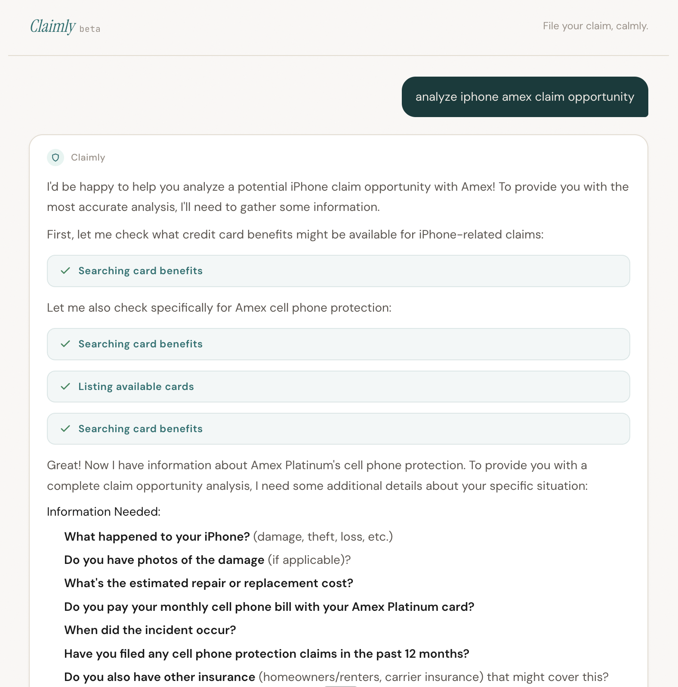
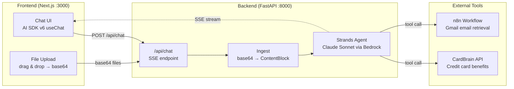
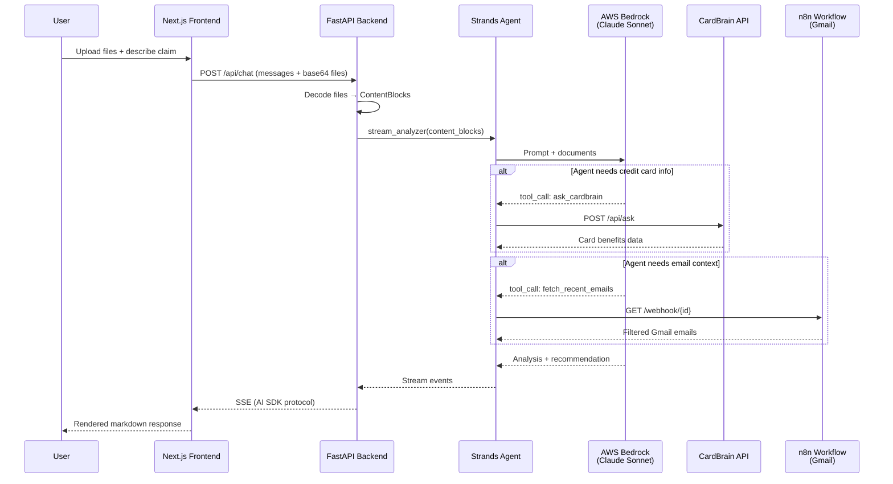

# Claimly

**File your claim, calmly.** An AI-powered insurance claim preparation agent that helps you decide whether to file a claim and prepares you for the call.



## What it does

Upload your policy documents, damage photos, or receipts. Claimly analyzes everything and gives you:

- A clear **FILE / DON'T FILE** recommendation
- Estimated damage vs. deductible math
- Premium impact assessment
- Claim call preparation script (if filing is recommended)

## Architecture



### Data Flow



- **Frontend**: Next.js 15 App Router + AI SDK `useChat` + Tailwind CSS v4
- **Backend**: Python FastAPI + [Strands Agents SDK](https://github.com/strands-agents/sdk-python) + AWS Bedrock (Claude Sonnet)
- **Tools**: CardBrain (credit card benefits lookup), n8n workflow (Gmail email retrieval)
- **Protocol**: AI SDK UI Message Stream Protocol over SSE

## Quick start

### Prerequisites

- Node.js 18+
- Python 3.12+
- AWS credentials with Bedrock access (profile: `tokenmaster`)

### Backend

```bash
cd backend
cp .env.example .env   # edit if needed
uv sync
uv run uvicorn claim_agent.api:app --port 8000 --reload
```

### Frontend

```bash
cd frontend
npm install
npm run dev
```

Open [http://localhost:3000](http://localhost:3000)

### URL parameters

Pre-fill the chat with a custom prompt:

```
http://localhost:3000/?prompt=I+had+a+fender+bender+and+need+help
```

## Supported file types

| Type | Extensions |
|------|-----------|
| Documents | `.pdf`, `.doc`, `.docx`, `.txt` |
| Images | `.jpg`, `.jpeg`, `.png`, `.gif`, `.webp` |

## Project structure

```
claim-agent/
  backend/
    src/claim_agent/
      api.py              # FastAPI SSE endpoint
      config.py           # Environment config
      model.py            # Bedrock model factory
      ingest.py           # File → ContentBlock conversion
      tools/
        cardbrain.py      # Credit card benefits tools
        n8n_email.py      # Email retrieval via n8n workflow
      agents/
        analyzer.py       # Claim analysis agent
    tests/
  frontend/
    app/
      page.tsx            # Landing page (reads ?prompt param)
      api/chat/route.ts   # Proxy to Python backend
      globals.css         # Claimly theme
      layout.tsx          # Fonts + metadata
    components/
      chat.tsx            # Chat container + interactive landing
      message-list.tsx    # Message rendering with markdown
      input-bar.tsx       # Text input + file upload
      file-preview.tsx    # File thumbnails
```
